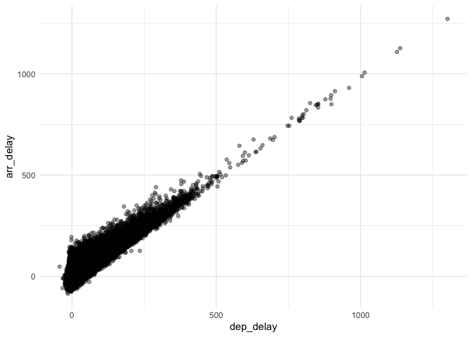

<!-- README.md is generated from README.Rmd. Please edit that file -->

# graphs

Quickly generate scatter plots to examine relationships between numeric
variables as part of exploratory data analysis

## Installation

You can install the development version of graphs like so:

Package installation can be performed directly by calling
`devtool::install_github("puneetarora22/graphs")`

## Example

To run this example, you must first load the package using the
`library()` function

An example data frame has been provided to showcase function usage. One
can also import datasets from other packages using the form
`package::function()`

1.  The `example_data` is used to create a scatter plot using a
    dataframe within the package itself

2.  The `flight_delay_example` uses the `flights` dataset from
    `nycflights13` package to show association between departure and
    arrival delays.

``` r
library(graphs)
library(nycflights13)

example_data <- data.frame(
  age = c(20, 22, 30, 35, 42, 50, 63, 68, 70,75, 80),
  total_lipid_count = c(120, 123, 130, 150, 175, 172, 185, 190, 200, 198, 205)
)
scatter_plot (example_data, age, total_lipid_count)
```


``` r

flight_delay_example <- scatter_plot(nycflights13::flights, dep_delay, arr_delay)
flight_delay_example
#> Warning: Removed 9430 rows containing missing values or values outside the scale range
#> (`geom_point()`).
```


