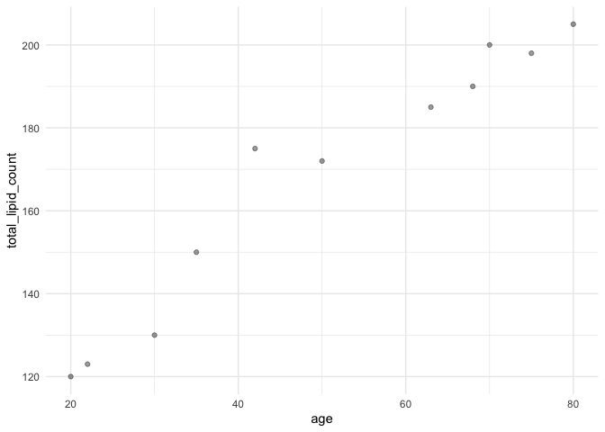

<!-- README.md is generated from README.Rmd. Please edit that file -->

# graphs

<!-- badges: start -->
<!-- badges: end -->

The goal of graphs is to …

## Installation

You can install the development version of graphs like so:

Package installation can be performed directly by calling
`devtool::install_github("puneetarora22/graphs")`

## Example

This is a basic example which shows you how to solve a common problem:

``` r
library(graphs)

example_data <- data.frame(
  age = c(20, 22, 30, 35, 42, 50, 63, 68, 70,75, 80),
  total_lipid_count = c(120, 123, 130, 150, 175, 172, 185, 190, 200, 198, 205)
)

scatter_plot (example_data, age, total_lipid_count)
```


